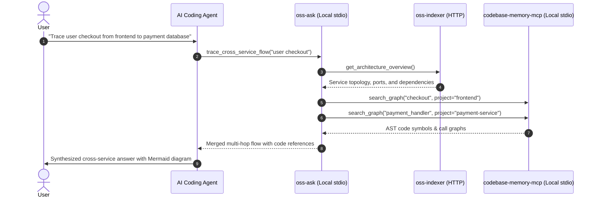

# oss-ask

<p align="center">
  
</p>

<p align="center">
  <a href="https://github.com/Abbilville/oss-ask/releases"></a>
  <a href="https://golang.org/"></a>
  <a href="https://modelcontextprotocol.io/"></a>
  <a href="LICENSE"></a>
</p>

`oss-ask` is the lightweight, agent-facing **query and composition engine** for microservice and multi-repository architectures. Built in Go using the official [Model Context Protocol Go SDK](https://github.com/modelcontextprotocol/go-sdk), it runs locally on standard input/output (stdio) spawned directly by AI agents (Claude Desktop, Claude Code, Cursor IDE, OpenAI Codex, and Google Antigravity).

It orchestrates between:
1. **[`oss-indexer`](https://github.com/Abbilville/oss-indexer)**: The central topology owner and manifest indexer (over HTTP/Streamable MCP).
2. **[`codebase-memory-mcp`](https://github.com/DeusData/codebase-memory-mcp)**: The AST graph engine for deep symbol and call-chain analysis (over local stdio).

---

## ⚡ Highlights

- **Unified Cross-Service Tracing**: Combines high-level network topology (ports, routes, dependencies) with deep AST call paths into seamless, multi-hop sequences.
- **Embedded Reasoning Guides**: Zero dependency on external skill folders. Uses `go:embed` to supply self-contained markdown workflow instructions directly to the model.
- **Zero-Friction Agent Setup**: A single `setup-agent` command configures all three MCP servers (`oss-indexer`, `oss-ask`, `codebase-memory-mcp`) into Claude, Cursor, Antigravity, and Codex.

---

## 🚀 Quick Start

### 1. Installation

#### Pre-built Binaries (Recommended)
Download the latest binary for your OS/Architecture from [GitHub Releases](https://github.com/Abbilville/oss-ask/releases).

#### Build from Source
```bash
git clone https://github.com/Abbilville/oss-ask.git
cd oss-ask
go build -o bin/oss-ask ./cmd/oss-ask
```

### 2. Auto-Configure AI Agents

Inject `oss-ask`, `oss-indexer`, and `codebase-memory-mcp` into your coding assistants:

```bash
# Global machine-wide configuration (Claude Desktop, Antigravity, Codex)
oss-ask setup-agent --agent all --global --indexer-url http://127.0.0.1:8080

# Workspace-local configuration (.agents/, .cursor/, CLAUDE.md)
oss-ask setup-agent --agent all --workspace /path/to/workspace --indexer-url http://127.0.0.1:8080
```

### 3. Agent Execution (Stdio)

AI agents spawn `oss-ask` automatically via their MCP configuration:
```bash
oss-ask run
```

---

## 🛠️ CLI Reference

```bash
# Launch MCP server over stdio transport
oss-ask run [--indexer-url <url>] [--auth-token <secret>]

# Query and display architecture topology in terminal
oss-ask list [--project <id>] [--indexer-url <url>] [--json]

# List registered projects and active knowledge graphs
oss-ask projects [--indexer-url <url>] [--json]

# Configure AI coding assistants
oss-ask setup-agent [--agent antigravity|claude|cursor|codex|all] [--global] [--workspace <path>]

# Update agent configurations
oss-ask update-agent [--agent all] [--global]

# Remove configurations from agents
oss-ask uninstall-agent [--agent all] [--global]
```

---

## 🔌 Exposed MCP Tools

| Tool | Type | Description | Inputs |
| :--- | :--- | :--- | :--- |
| `trace_cross_service_flow` | Read (Composite) | Queries `oss-indexer` for topology, queries `codebase-memory-mcp` for AST call paths, and returns merged end-to-end hop sequences with code symbols. | `query` (string), `source_repo?` (string), `target_repo?` (string), `project?` (string) |
| `get_workflow_guide` | Read | Retrieves embedded markdown reasoning guidelines (`oss` or `oss-navigator`). | `guide_name` (`"oss"` \| `"oss-navigator"`) |

---

## 🧩 Architecture Topology



---

## 📄 License

MIT © [Abbilville](https://github.com/Abbilville)
